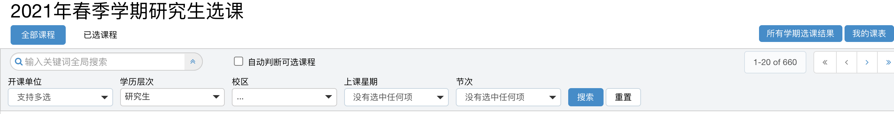
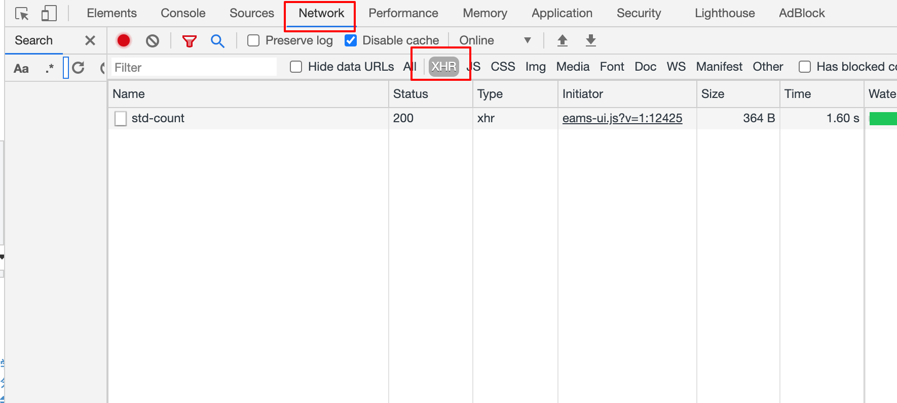
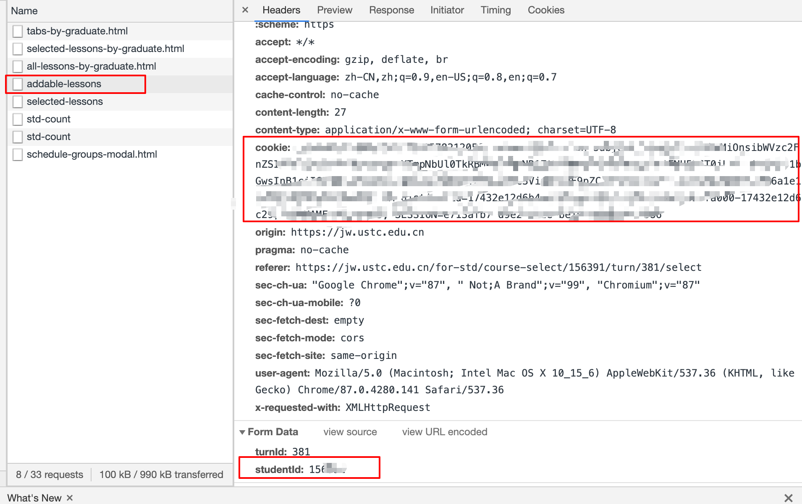
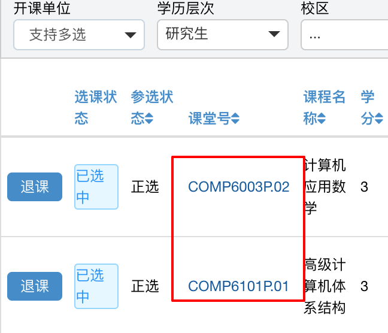

## USTC 多线程抢课脚本 

### 使用情形：

- 课已满，一有人退课就抢
- 争分夺秒抢热门课，比如【茶与健康】等

### 依赖

pip install requests

### 运行

按照下方的配置教材填写 config.py

python main.py

### 示例结果

### 配置教程

####  第一步 登录选课界面

#### 第二步 按 F12

分别选择network 和 XHR

#### 第三步 按F5或者浏览器刷新页面

如下点击addable-lessons

将cookie和studentId 填进config.py文件

#### 第四步 选择要抢的课程编号进行多线程抢课

课堂号 填入 course_id

# END

仅供学术交流：）